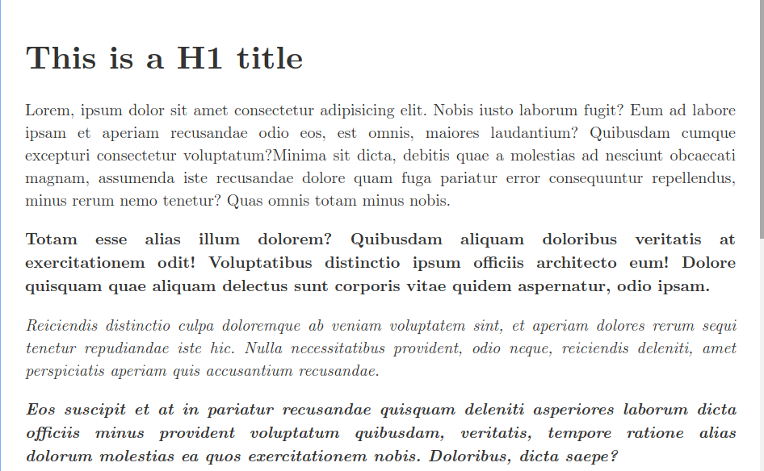

# This is a H1 title

Lorem, ipsum dolor sit amet consectetur adipisicing elit. Nobis iusto laborum fugit? Eum ad labore ipsam et aperiam recusandae odio eos, est omnis, maiores laudantium? Quibusdam cumque excepturi consectetur voluptatum?Minima sit dicta, debitis quae a molestias ad nesciunt obcaecati magnam, assumenda iste recusandae dolore quam fuga pariatur error consequuntur repellendus, minus rerum nemo tenetur? Quas omnis totam minus nobis.

**Totam esse alias illum dolorem? Quibusdam aliquam doloribus veritatis at exercitationem odit! Voluptatibus distinctio ipsum officiis architecto eum! Dolore quisquam quae aliquam delectus sunt corporis vitae quidem aspernatur, odio ipsam.**

*Reiciendis distinctio culpa doloremque ab veniam voluptatem sint, et aperiam dolores rerum sequi tenetur repudiandae iste hic. Nulla necessitatibus provident, odio neque, reiciendis deleniti, amet perspiciatis aperiam quis accusantium recusandae.*

***Eos suscipit et at in pariatur recusandae quisquam deleniti asperiores laborum dicta officiis minus provident voluptatum quibusdam, veritatis, tempore ratione alias dolorum molestias ea quos exercitationem nobis. Doloribus, dicta saepe?***

## This is a H2 title

~~Impedit iste velit minima corporis amet ratione odio eos? Quaerat reprehenderit numquam animi dolores ut dolorem commodi saepe labore incidunt porro. Hic enim cupiditate repellat, suscipit molestiae natus eligendi eius.~~

==Beatae maxime recusandae reiciendis cumque laborum voluptates consequuntur assumenda aut ea architecto voluptas animi harum placeat, similique temporibus expedita culpa iure ut, deleniti voluptate iste quas delectus! Repudiandae, at assumenda.==

`Aperiam, ex nobis totam id cupiditate corporis error ipsum iste harum iure eaque dolorem repellendus pariatur excepturi voluptatem a necessitatibus quibusdam unde nihil voluptatibus? Molestiae quo nobis architecto optio ducimus.`

### This is a H3 title

```python
line:str= "Praesentium natus libero cupiditate quas fuga exercitationem esse dolorem ut architecto aliquid reprehenderit ullam, ab voluptate eius molestias vero repudiandae sit est tempore asperiores maiores deleniti, mollitia quisquam minima? Eligendi!"
n:int = 0
s=12+n
```

Assumenda ^2^ ~1~ natus nam excepturi voluptatem. Optio placeat debitis saepe eligendi qui, accusantium quis dolore autem ut vero? Et magnam quisquam cum pariatur repudiandae necessitatibus aliquam?

<!--Tenetur maxime labore veritatis aut. Expedita exercitationem ducimus doloremque hic sapiente culpa! Laborum non recusandae nesciunt, blanditiis animi repellendus optio nostrum voluptatum molestiae quidem dolor consequuntur pariatur. Id, vitae adipisci.-->

[Reiciendis dicta quo tempore voluptates odit, culpa fuga. Molestiae rerum quas nulla nostrum doloremque, incidunt quos veniam voluptas, inventore ratione libero, adipisci beatae repellat placeat numquam distinctio modi. Eveniet, laboriosam.](localhost)

#### This is a H4 title

$Python = Java - Type $

| Col1 1                                                       | Col 2                                                        |
| ------------------------------------------------------------ | ------------------------------------------------------------ |
| In nemo sint impedit eligendi magnam, itaque veritatis distinctio quae minima adipisci nisi obcaecati eaque esse, eius necessitatibus. Repudiandae perferendis aperiam necessitatibus veritatis, hic voluptates beatae cumque aliquam culpa nam? | In nemo sint impedit eligendi magnam, itaque veritatis distinctio quae minima adipisci nisi obcaecati eaque esse, eius necessitatibus. Repudiandae perferendis aperiam necessitatibus veritatis, hic voluptates beatae cumque aliquam culpa nam? |
| In nemo sint impedit eligendi magnam, itaque veritatis distinctio quae minima adipisci nisi obcaecati eaque esse, eius necessitatibus. Repudiandae perferendis aperiam necessitatibus veritatis, hic voluptates beatae cumque aliquam culpa nam? | In nemo sint impedit eligendi magnam, itaque veritatis distinctio quae minima adipisci nisi obcaecati eaque esse, eius necessitatibus. Repudiandae perferendis aperiam necessitatibus veritatis, hic voluptates beatae cumque aliquam culpa nam? |

$$
Javascript + Type = Typescript
\\
Shell + Z = Zsh
$$


- In nemo sint impedit eligendi magnam, itaque veritatis distinctio quae minima adipisci nisi obcaecati eaque esse, eius necessitatibus. Repudiandae perferendis aperiam necessitatibus veritatis, hic voluptates beatae cumque aliquam culpa nam?

- Ipsum facere aliquid veritatis? Corporis reprehenderit unde quis quos, sequi, impedit dolorum deserunt necessitatibus at rem odit nesciunt dolorem sed velit non similique repudiandae? Ratione soluta incidunt eveniet numquam sequi.
- At cumque, voluptate modi necessitatibus possimus assumenda! Perferendis nobis similique expedita asperiores, sapiente nemo esse minima deleniti ipsa voluptas distinctio quo reiciendis ratione provident dolorum molestiae neque? Impedit, delectus odio.

##### This is a H5 title

1. Consequuntur repudiandae iusto voluptatem neque rerum porro recusandae totam qui ab autem accusamus id culpa tempore atque, rem modi ad! Nulla ea maiores tenetur, consequatur exercitationem libero consequuntur temporibus magnam?
   1. Repellat, accusamus aut iusto cumque molestias quis quos. Libero error maiores soluta debitis exercitationem in quasi est, atque explicabo magnam placeat tempora non nam quo dolore velit voluptates corporis optio?
      1. Cumque adipisci earum rem expedita velit error, deserunt cum esse perspiciatis sapiente unde obcaecati illum laborum consequuntur, omnis modi at pariatur quo quis alias et. Veritatis aliquam labore dicta facere!
      2. Iste soluta atque nemo nesciunt facere exercitationem consequuntur tempora odio quam modi obcaecati, vel officia blanditiis consectetur esse quod autem voluptatibus. Sequi ratione quaerat, natus voluptate aperiam tempore quia cupiditate.
2. Repellendus error rerum cum natus voluptates animi atque aspernatur facilis ipsam aliquid illo nemo, neque temporibus, vero vel repellat libero? Natus eveniet vero odit. Delectus quod fugiat officiis velit et!

###### This is a H6 title

- [ ] Eligendi omnis quas architecto ut necessitatibus ex magnam iusto, velit quae odio provident nostrum esse explicabo, soluta doloremque sit expedita, amet nobis debitis alias numquam facere dignissimos. Alias, aperiam reprehenderit?

- [x] Error at minus ullam ab cum ducimus eaque similique neque provident voluptate laboriosam reprehenderit deleniti, quam harum quo dolorum impedit voluptatibus corrupti eum reiciendis. Optio tempora quidem quae soluta quasi!

- [ ] Deleniti, in modi rem saepe sit rerum assumenda minima molestiae totam velit quo, temporibus tenetur eligendi non nisi iste numquam corporis quaerat voluptates consequuntur fugiat? Nisi accusantium nesciunt quis autem!


> theme

<figure>
  
  <figcaption>Theme</figcaption>
</figure>
